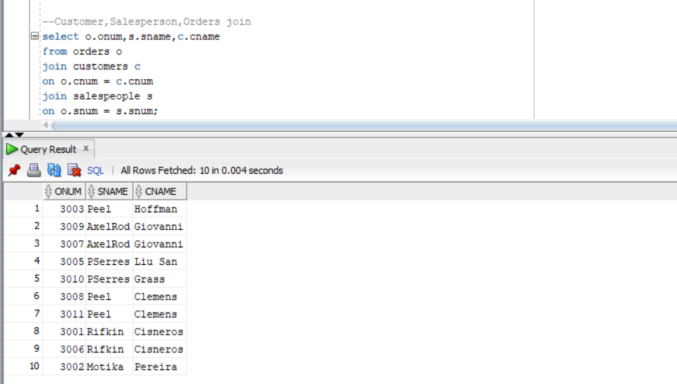
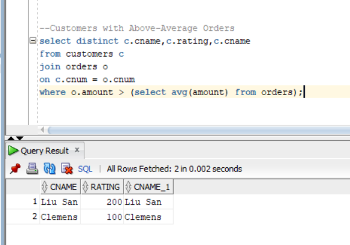
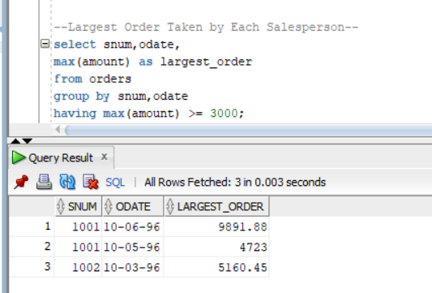
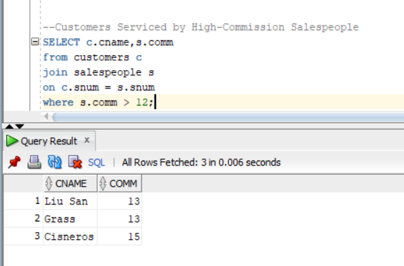
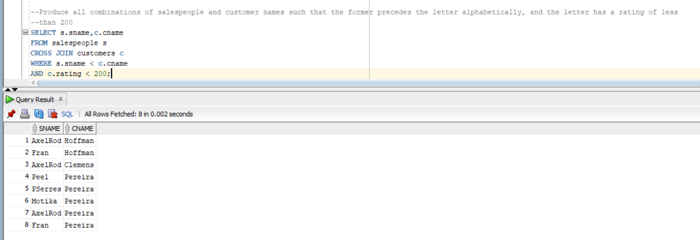
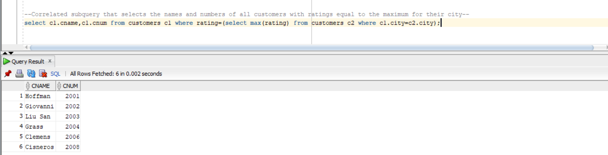

# Sales & Customer Analytics using Oracle SQL

## Overview

This project demonstrates SQL-based analysis on a sales database containing Customers, Orders, and Salespeople tables. The project focuses on solving business-oriented problems using joins, subqueries, correlated subqueries, aggregations, and relationship analysis.

## Key SQL Skills Demonstrated

- SELECT Statements
- WHERE Clause
- ORDER BY
- Aggregate Functions (SUM, AVG, COUNT, MAX, MIN)
- GROUP BY
- HAVING
- Joins
- Self Joins
- Subqueries
- Correlated Subqueries
- EXISTS
- ANY and ALL Operators
- Date Functions
- String Functions

## Sample Business Questions Solved

- Find customers with above-average orders
- Find the largest order taken by each salesperson
- Find departments with high average salaries
- Match customers and salespeople by city
- Count orders handled by each salesperson
- Find customers with the same ratings
- Analyze customer and sales performance## Project Highlights

## Project Highlights

### 1. Multi-Table Join Analysis

---

### 2. Customers with Above-Average Orders

---

### 3. Largest Order by Salesperson

---

### 4. High-Commission Salespeople Serving Customers

---

### 5. Salesperson-Customer Relationship Mapping

---

### 6. Correlated Subquery Analysis

## Tools Used

- Oracle SQL
- GitHub

## Author

Jidnesh Salve
